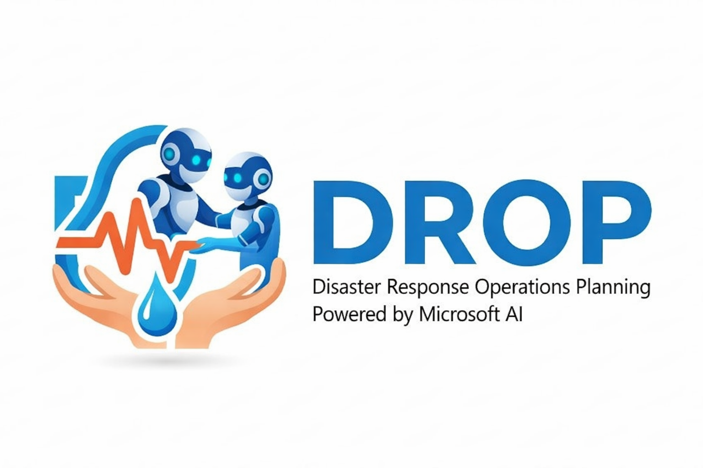
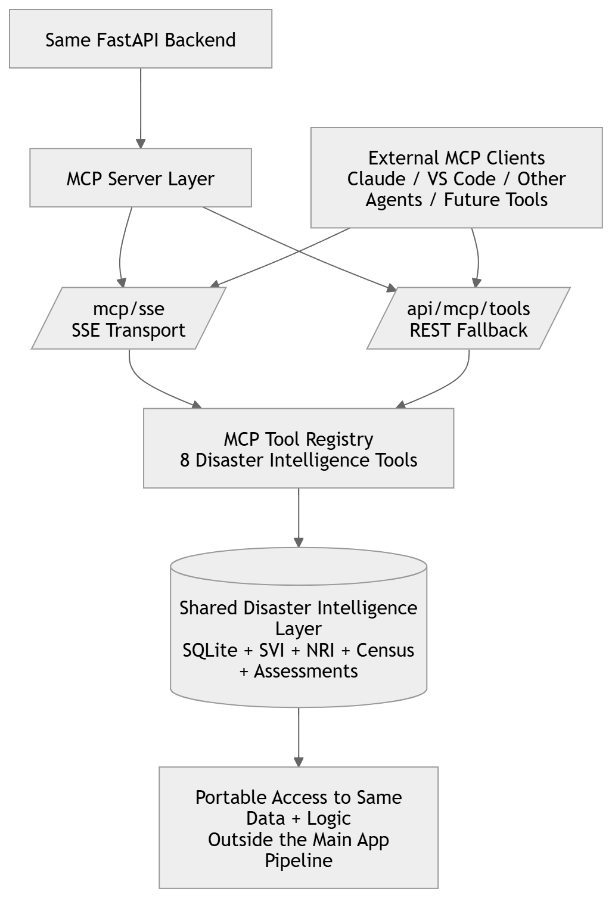
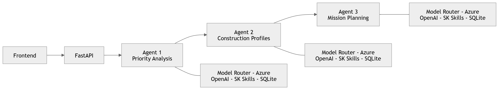
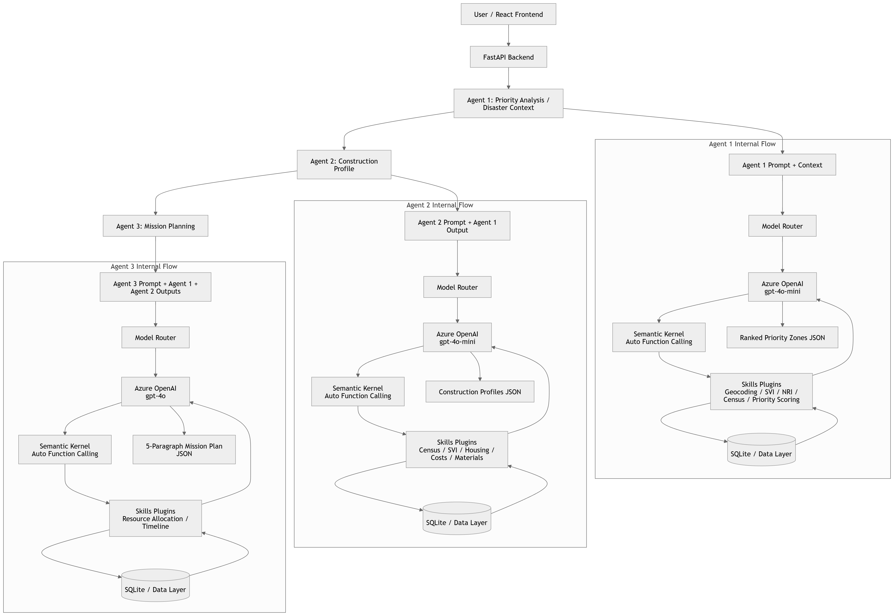

# DROP — Disaster Response Operations Plan

 

## Hackathon Info
**Team:** Leo, Gaby, Travis & Jethro <br>
**Hackathon:** Microsoft AI Dev Days Hackathon <br>
**Live Demo Site:** [DROP Demo Site](https://nice-coast-0b3959d1e.1.azurestaticapps.net/)  <br>
**Demo Video:** [Youtube Link](https://youtu.be/fxud_2mnaLk) <br>
**Stack:** Python · FastAPI · Semantic Kernel · Azure OpenAI (GPT-4o) · React · Vite · Azure Static Web Apps · Azure AI Vision

---

## What is DROP?
**DROP** is our submission for the [Microsoft AI Dev Days hackathon](https://developer.microsoft.com/en-us/reactor/events/26647/). It includes a multi-agent system and Azure services to help disaster responders plan. Based on information from [Team Rubicon](https://teamrubiconusa.org/), a nonprofit dedicated to disaster response and recovery, we built a system to reduce their time spent doing manual tasks when deciding which personnel and resources are necessary in a disaster response.

DROP automates disaster response mission planning for Team Rubicon operators. A mission planner describes a disaster event — or pastes a FEMA declaration — and DROP's multi-agent AI pipeline produces a complete, field-ready plan **in minutes**. DROP was built using Azure services including Azure OpenAI, and it accomplishes our mission to automate and improve disaster response operations for real impact by working with Team Rubicon (TR).

**Without DROP:** operators manually cross-reference open-source data, including social vulnerability index (SVI) per location, national risk index (NRI) tables, Census housing data, and Hazus building stock reports to prioritize zones, then hand-author a 5-paragraph operation plan (known as Standard Operating Procedure or SOP).

**With DROP:** that same workflow takes a few clicks and produces a structured, exportable operations plan (SOP) with ranked priority zones, structural profiles, phased timelines, and resource allocations. The second version of DROP includes a field assessment pipeline to upload images to create real-time data and labels for damage classification.

---

## Mission Planning powered by AI

```
Disaster Strikes - Event Trigger / FEMA Declaration
          │
          ▼
┌─────────────────────────┐
│ Priority Analysis Agent │  ← Open source Data (SVI + NRI + Census) → priority zones
└─────────────┬───────────┘
              │  human approval gate
              ▼
┌──────────────────────────────┐
│ Construction Profile Agent   │ + Analysis on FEMA Databases → structural profiles per zone
└──────────────┬───────────────┘
               │  human approval gate
               ▼
┌──────────────────────────────┐
│   Mission Planning Agent     │  ← generates full 5-paragraph Operation Plan + .docx export
└──────────────────────────────┘
```

Each agent step has a **human approval gate** before the pipeline advances. A **side-drawer chat** lets operators ask questions or request adjustments at any step — operators can interact and update their plans assisted by memory-persistent agents, all with natural language in this chat.

## Field Assessment for real-time updates
```
Zone Selection - based on Priority Analysis Agent output
          │
          ▼
┌─────────────────────────┐
│  Field Assessment Agent │  ← Photo upload
└─────────────┬───────────┘
              │  human approval gate
              ▼
┌──────────────────────────────┐
│       Azure AI VIsion        │ + Scene detection, tags, OCR
└──────────────┬───────────────┘
               │  human approval gate
               ▼
┌──────────────────────────────┐
│        Azure ML + GPT 4o     │  ← generates damage classification, tags + annotations
└──────────────┬───────────────┘
               │  human approval gate
               ▼
┌──────────────────────────────┐
│        Annotate & Submit     │  ← add notes, upload to mission database, add to report
└──────────────────────────────┘
```
---
During a disaster, things change quickly. Even unverified information, like a citizen reporting a downed power line, will help in planning to respond. This feature of field assessments, integrated with the multi-agent pipeline, allows for real-time updates. 
**DROP** is a consolidated resource for the latest info and getting to a plan. 

## Project Overview

### 1. Technological Implementation

DROP is built on production-grade, well-structured code throughout.

**Semantic Kernel agent architecture** — Semantic Kernel serves as the foundational orchestration layer, it connects the FastAPI backend to Azure OpenAI, manages prompt execution, and handles the plugin/function-calling pipeline.
On top of that, DROP has a multi-agent architecture with specialized agents (for example the Priority Analysis Agent, and others powering the mission planning wizard steps and the field assessment photo analysis). All agents inherit from a shared BaseAgent class that handles kernel initialization, Azure OpenAI wiring, automatic function-calling loops, structured JSON output parsing, and conversation history management. Subclasses only implement agent_name, system_prompt, and register_skills().

```python
# SK's auto function-calling loop — the LLM calls tools until it has enough data
exec_settings.function_choice_behavior = FunctionChoiceBehavior.Auto(
    auto_invoke=True,
    filters={"included_plugins": self._get_plugin_names()},
)
```
**Model Routing** - built in model router for per-agent model assignment, optimize costs and capacity constraints.

**Native function plugin library** — 12 typed Semantic Kernel plugins expose real government datasets as LLM-callable tools:

| Plugin | Data Source | What It Returns |
|--------|-------------|-----------------|
| `SVILookupSkill` | CDC SVI 2022 | Social vulnerability scores + 4 theme percentiles by census tract |
| `NRILookupSkill` | FEMA NRI | Natural hazard risk scores + expected annual loss by tract |
| `PriorityScoringSkill` | Deterministic engine | Composite weighted scores; configurable SVI/NRI/housing/density weights |
| `HousingStockSkill` | Hazus GBS | Structure counts, roof types, foundation types, flood zones |
| `MaterialProfileSkill` | Reference DB | Roofing, framing, walls by building type + era + region |
| `ResourceAllocationSkill` | Rules engine | Personnel, equipment, and materials calc from zone/structure counts |
| `TimelineGeneratorSkill` | Rules engine | Phased ops timeline with overlapping assessment/response phases |
| `SOPTemplateSkill` | TR schema | Validates SOP JSON against 5-paragraph Team Rubicon format |

**MCP Integration** - 8 tools available via Model Context Protocol (SSE transport + REST), easily configure additional MCP connections.<br>

**FastAPI backend** with lifespan management, async SQLite (9-table schema), structured logging via `structlog`, CORS middleware, and streaming `.docx` export.

**Code quality:** consistent module structure, docstrings on every class and function, typed parameters, explicit error handling with logged failures, no magic numbers in scoring logic. <br>

**Front-end Diagram**
 <br>

---

### 2. Agentic Design

OpsPlan implements a **sequential multi-agent pipeline with human-in-the-loop gates** — a deliberate design choice for high-stakes emergency response contexts where operator trust and auditability matter more than full automation.

**Auto function-calling loop per agent:** each agent autonomously decides which tools to call, in what order, and how many times — based on what data it needs to answer the planning question. The Disaster Context Agent, for example, may call `get_svi_by_county`, `get_nri_by_county`, `compute_housing_vulnerability`, and `score_zones` in sequence without explicit orchestration code.

**Persistent chat with tool access:** the side-drawer chat isn't a simple Q&A wrapper. The agent retains its full conversation history and plugin registry, so operators can ask "what's the SVI score for tract 48007950101?" mid-session and get a live database lookup, not a hallucination.

**Structured output contract:** `BaseAgent._parse_structured_output()` handles JSON extraction from raw LLM text with multiple fallback strategies (code block stripping, substring scanning), ensuring downstream agents always receive typed data regardless of model formatting variance.

**Configurable scoring weights:** the priority scoring engine accepts operator-supplied weights at runtime, letting commanders adjust the SVI/NRI/housing/density balance for different disaster types (hurricane vs. flood vs. tornado) without code changes.

**Inbound communications pipeline:** the API includes webhook endpoints for ACS SMS and Microsoft Graph email, with idempotent ingestion, auto-parsing of field assessments, and subscription lifecycle renewal — laying groundwork for real-time field operator reporting back into the planning system.

**Agent Diagram**
 <br>

---


### 3. Real-World Impact & Applicability 

**The problem is real and significant.** Disaster response organizations, like Team Rubicon, deploy thousands of volunteers on disaster missions annually. Mission planning currently requires specialists to manually synthesize multiple government datasets and author plans under time pressure, immediately after a disaster strikes — when speed directly affects lives.

**The data is real.** DROP queries three authoritative open government datasets:
- **CDC SVI 2022** (~85 MB) — social vulnerability by census tract, including poverty rates, disability, mobile home density, and language barriers
- **FEMA NRI** (~180 MB) — natural hazard risk scores and expected annual loss by census tract
- **Census ACS 5-Year** — housing types, occupancy, and financial data via live API

These aren't mock datasets. The Hurricane Harvey demo uses real FIPS tracts for Aransas, Refugio, Calhoun, Victoria, and San Patricio counties in Texas.

**Production deployment readiness:**
- Live on Azure Static Web Apps: https://nice-coast-0b3959d1e.1.azurestaticapps.net/
- Backend designed for Azure Container Apps or App Service
- Config managed via environment variables with `.env.example` template
- Database initialization scripted (`scripts/setup_db.py`) with data loaders for each source
- `.docx` Operation Plan export ready to hand to a field commander
- Async database layer, structured logging, and health endpoint (`GET /health`) are production patterns
- Azure services: Azure OpenAI, Azure AI Vision 4.0, Azure Container Registry (see full list [here](https://github.com/gabycb/Hackathon26_TeamRubiconProject/blob/main/opsplan/README.md#azure-services-used)) <br>

**Extensibility:** the `services/` directory scaffolds Weather Sentinel integration, authentication, and push notifications as named next steps — not afterthoughts.

---

### 4. User Experience

**Wizard-based workflow** maps directly to how disaster response operators think: define the event → review zone rankings → review construction profiles → review and export the plan. The 4-step progression mirrors the actual planning sequence, so the UI itself teaches the process. It's just as easy to upload field photos with images and get real-time damage assessments, all consolidated and used to update the planning requirements.

**Human approval gates** are a deliberate UX feature, not a limitation. In emergency response, operators need to be able to catch and correct AI errors before they propagate downstream. Each gate shows the agent's full output before advancing.

**Pre-fill from Alert** loads Hurricane Harvey data in one click, making the demo immediately runnable without manual data entry.

**Side-drawer agent chat** is accessible from any step in the wizard, letting operators interrogate assumptions or request adjustments without leaving their current context.

**Frontend/backend balance:**
- React + Vite frontend handles wizard state, zone selection, tabbed profile views, and SOP section navigation
- Backend handles all data access, agent orchestration, and document generation — the frontend is stateless and thin
- Vite dev proxy eliminates CORS friction in development; production uses Azure Static Web Apps routing

**Export:** the `.docx` operation plan output is formatted for actual field use — not a JSON dump, but a structured Word document a commander can print and brief from.

---

### 5. Hackathon Information

DROP was built specifically for the **Microsoft Dev Days Hackathon Challenge** and accomplishes our mission to automate and improve disaster response operations with input from a veteran-led humanitarian organization, Team Rubicon (TR).

Every design decision traces back to Team Rubicon's actual operational context:
- The **5-paragraph plan format** (Situation, Mission, Execution, Sustainment, Command & Signal) is the operations plan standard — `SOPTemplateSkill` validates against it explicitly
- **Priority scoring weights** (SVI 30%, NRI 30%, housing vulnerability 25%, population density 15%) reflect TR's focus on the most socially vulnerable populations, not just highest-damage zones
- **Resource allocation rules** model TR's typical team structure: 4-person assessment teams, 4-person response crews, zone-based equipment scaling
- The **inbound communications pipeline** addresses a real TR operational need: field teams texting damage assessments back to command

The system is not a generic disaster tool repurposed for the hackathon. It is built around TR's data, TR's format, TR's team structure, and TR's mission.

---

## Structure of this REPO (with all hackathon requirements)

```
ProjectReport.md                    # background research and full report on project
images/                             # reference images + architecture diagram
testcode/
├── sample code/                    # used as reference when building with Github Copilot

opsplan/                         # main code for application, later renamed DROP
├── frontend/                    # React + Vite UI
│   └── src/
│       ├── App.jsx              # 4-step wizard + chat + mobile responsive
│       └── FieldAssessment.jsx  # Part 2: 6-screen mobile assessment flow
├── agents/                      # Semantic Kernel agents
│   ├── base_agent.py            # Base class with Model Router integration
│   ├── disaster_context/        # Agent 1: Priority Analysis
│   ├── construction_profile/    # Agent 2: Construction Profiles
│   └── mission_planning/        # Agent 3: Mission Plan generation
├── skills/                      # SK native function plugins (12 tools)
│   ├── svi_lookup.py            # CDC SVI queries
│   ├── nri_lookup.py            # FEMA NRI queries
│   ├── census_lookup.py         # Census ACS + vulnerability profiles
│   ├── priority_scoring.py      # Deterministic composite scoring
│   ├── resource_allocation.py   # Personnel/equipment calculator
│   ├── timeline_generator.py    # Phased ops timeline
│   └── ...
├── services/
│   └── mcp_server.py            # MCP Server — 8 tools via SSE transport
├── config/
│   ├── settings.py              # Environment config loader
│   └── model_router.py          # Per-agent model assignment
├── api/
│   ├── main.py                  # FastAPI — endpoints + CORS + MCP mount
│   ├── photo_assessment.py      # Azure AI Vision + GPT-4o pipeline
│   ├── export_sop.py            # Mission Plan .docx generator
│   └── export_assessment.py     # Field Assessment .docx report
├── data/
│   ├── schema.sql               # SQLite schema (9 tables)
│   ├── db.py                    # Async database module
│   ├── opsplan.db               # Pre-loaded SVI/NRI/Census data
│   └── loaders/                 # Data loading scripts
├── Dockerfile                   # Container build
├── deploy.ps1                   # Azure deployment script (PowerShell)
├── requirements.txt             # Python dependencies
└── staticwebapp.config.json     # SWA auth + routing config
```

---

## Quick Start
Follow the OpsPlan Quick start [here](https://github.com/gabycb/Hackathon26_TeamRubiconProject/blob/main/opsplan/README.md#quick-start-local-development) to download and test in your environment. 
### Prerequisites
- Python 3.11+
- Node.js 18+
- Azure OpenAI resource with a GPT-4o deployment
- Census API key (free) — https://api.census.gov/data/key_signup.html

---

## System Diagrams
[Architecture Diagram (PDF)](https://github.com/gabycb/Hackathon26_TeamRubiconProject/blob/main/images/architecture_diagram.pdf)

### Mermaid Diagram
 <br>

**THYNK UNLIMITED** — Team Rubicon Hackathon
