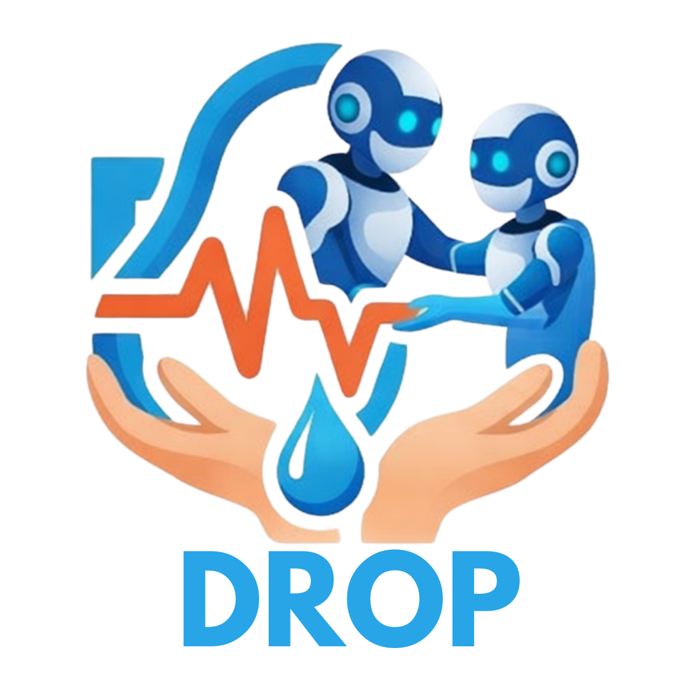

# DROP — Disaster Response Operations Plan

 

## Hackathon Info
**Team:** Leo, Gaby, Travis & Jethro <br>
**Hackathon:** Microsoft AI Dev Days Hackathon <br>
**Live Demo:** https://nice-coast-0b3959d1e.1.azurestaticapps.net/  <br>
**Stack:** Python · FastAPI · Semantic Kernel · Azure OpenAI (GPT-4o) · React · Vite · Azure Static Web Apps 

---

## What is DROP?

DROP automates disaster response mission planning for Team Rubicon operators. A commander describes a disaster event — or pastes a FEMA declaration — and DROP's three-agent AI pipeline produces a complete, field-ready Standard Operating Procedure in minutes. DROP was built specifically for the **Microsoft Dev Days Hackathon Challenge** and accomplishes our mission to automate and improve disaster response operations with input from a veteran-led humanitarian organization, Team Rubicon (TR).

**Without DROP:** operators manually cross-reference SVI data, NRI risk tables, Census housing data, and Hazus building stock reports to prioritize zones, then hand-author a 5-paragraph operation plan (known as SOP).

**With DROP:** that same workflow takes 3 clicks and produces a structured, exportable operationa plan (SOP) with ranked priority zones, structural profiles, phased timelines, and resource allocations.

---

## The 3-Agent Pipeline

```
[Event Description / FEMA Declaration]
          │
          ▼
┌─────────────────────────┐
│  Disaster Context Agent │  ← Open source Data (SVI + NRI + Census) → ranked priority zones
└─────────────┬───────────┘
              │  human approval gate
              ▼
┌──────────────────────────────┐
│  Construction Profile Agent  │  + Analysis on FEMA Databases → structural profiles per zone
└──────────────┬───────────────┘
               │  human approval gate
               ▼
┌──────────────────────────────┐
│   Mission Planning Agent     │  ← generates full 5-paragraph Operation Plan + .docx export
└──────────────────────────────┘
```

Each agent step has a **human approval gate** before the pipeline advances. A **side-drawer chat** lets operators ask questions or request adjustments at any step — agents still have full tool access during chat.

---

## Project Overview

### 1. Technological Implementation

DROP is built on production-grade, well-structured code throughout.

**Semantic Kernel agent architecture** — All three agents inherit from a shared `BaseAgent` class that handles kernel initialization, Azure OpenAI wiring, automatic function-calling loops, structured JSON output parsing, and conversation history management. Subclasses only implement `agent_name`, `system_prompt`, and `register_skills()`.

```python
# SK's auto function-calling loop — the LLM calls tools until it has enough data
exec_settings.function_choice_behavior = FunctionChoiceBehavior.Auto(
    auto_invoke=True,
    filters={"included_plugins": self._get_plugin_names()},
)
```

**Native function plugin library** — 12 typed Semantic Kernel plugins expose real government datasets as LLM-callable tools:

| Plugin | Data Source | What It Returns |
|--------|-------------|-----------------|
| `SVILookupSkill` | CDC SVI 2022 | Social vulnerability scores + 4 theme percentiles by census tract |
| `NRILookupSkill` | FEMA NRI | Natural hazard risk scores + expected annual loss by tract |
| `PriorityScoringSkill` | Deterministic engine | Composite weighted scores; configurable SVI/NRI/housing/density weights |
| `HousingStockSkill` | Hazus GBS | Structure counts, roof types, foundation types, flood zones |
| `MaterialProfileSkill` | Reference DB | Roofing, framing, walls by building type + era + region |
| `ResourceAllocationSkill` | Rules engine | Personnel, equipment, and materials calc from zone/structure counts |
| `TimelineGeneratorSkill` | Rules engine | Phased ops timeline with overlapping assessment/response phases |
| `SOPTemplateSkill` | TR schema | Validates SOP JSON against 5-paragraph Team Rubicon format |

**FastAPI backend** with lifespan management, async SQLite (9-table schema), structured logging via `structlog`, CORS middleware, and streaming `.docx` export.

**Code quality:** consistent module structure, docstrings on every class and function, typed parameters, explicit error handling with logged failures, no magic numbers in scoring logic.

---

### 2. Agentic Design

OpsPlan implements a **sequential multi-agent pipeline with human-in-the-loop gates** — a deliberate design choice for high-stakes emergency response contexts where operator trust and auditability matter more than full automation.

**Auto function-calling loop per agent:** each agent autonomously decides which tools to call, in what order, and how many times — based on what data it needs to answer the planning question. The Disaster Context Agent, for example, may call `get_svi_by_county`, `get_nri_by_county`, `compute_housing_vulnerability`, and `score_zones` in sequence without explicit orchestration code.

**Persistent chat with tool access:** the side-drawer chat isn't a simple Q&A wrapper. The agent retains its full conversation history and plugin registry, so operators can ask "what's the SVI score for tract 48007950101?" mid-session and get a live database lookup, not a hallucination.

**Structured output contract:** `BaseAgent._parse_structured_output()` handles JSON extraction from raw LLM text with multiple fallback strategies (code block stripping, substring scanning), ensuring downstream agents always receive typed data regardless of model formatting variance.

**Configurable scoring weights:** the priority scoring engine accepts operator-supplied weights at runtime, letting commanders adjust the SVI/NRI/housing/density balance for different disaster types (hurricane vs. flood vs. tornado) without code changes.

**Inbound communications pipeline:** the API includes webhook endpoints for ACS SMS and Microsoft Graph email, with idempotent ingestion, auto-parsing of field assessments, and subscription lifecycle renewal — laying groundwork for real-time field operator reporting back into the planning system.

---

### 3. Real-World Impact & Applicability 

**The problem is real and significant.** Disaster response organizations, like Team Rubicon, deploy thousands of volunteers on disaster missions annually. Mission planning currently requires specialists to manually synthesize multiple government datasets and author plans under time pressure, immediately after a disaster strikes — when speed directly affects lives.

**The data is real.** DROP queries three authoritative open government datasets:
- **CDC SVI 2022** (~85 MB) — social vulnerability by census tract, including poverty rates, disability, mobile home density, and language barriers
- **FEMA NRI** (~180 MB) — natural hazard risk scores and expected annual loss by census tract
- **Census ACS 5-Year** — housing types, occupancy, and financial data via live API

These aren't mock datasets. The Hurricane Harvey demo uses real FIPS tracts for Aransas, Refugio, Calhoun, Victoria, and San Patricio counties in Texas.

**Production deployment readiness:**
- Live on Azure Static Web Apps: https://nice-coast-0b3959d1e.1.azurestaticapps.net/
- Backend designed for Azure Container Apps or App Service
- Config managed via environment variables with `.env.example` template
- Database initialization scripted (`scripts/setup_db.py`) with data loaders for each source
- `.docx` Operation Plan export ready to hand to a field commander
- Async database layer, structured logging, and health endpoint (`GET /health`) are production patterns

**Extensibility:** the `services/` directory scaffolds Weather Sentinel integration, authentication, and push notifications as named next steps — not afterthoughts.

---

### 4. User Experience

**Wizard-based workflow** maps directly to how disaster response operators think: define the event → review zone rankings → review construction profiles → review and export the plan. The 4-step progression mirrors the actual planning sequence, so the UI itself teaches the process.

**Human approval gates** are a deliberate UX feature, not a limitation. In emergency response, operators need to be able to catch and correct AI errors before they propagate downstream. Each gate shows the agent's full output before advancing.

**Pre-fill from Alert** loads Hurricane Harvey data in one click, making the demo immediately runnable without manual data entry.

**Side-drawer agent chat** is accessible from any step in the wizard, letting operators interrogate assumptions or request adjustments without leaving their current context.

**Frontend/backend balance:**
- React + Vite frontend handles wizard state, zone selection, tabbed profile views, and SOP section navigation
- Backend handles all data access, agent orchestration, and document generation — the frontend is stateless and thin
- Vite dev proxy eliminates CORS friction in development; production uses Azure Static Web Apps routing

**Export:** the `.docx` operation plan output is formatted for actual field use — not a JSON dump, but a structured Word document a commander can print and brief from.

---

### 5. Hackathon Information

DROP was built specifically for the **Microsoft Dev Days Hackathon Challenge** and accomplishes our mission to automate and improve disaster response operations with input from a veteran-led humanitarian organization, Team Rubicon (TR).

Every design decision traces back to Team Rubicon's actual operational context:
- The **5-paragraph plan format** (Situation, Mission, Execution, Sustainment, Command & Signal) is the operations plan standard — `SOPTemplateSkill` validates against it explicitly
- **Priority scoring weights** (SVI 30%, NRI 30%, housing vulnerability 25%, population density 15%) reflect TR's focus on the most socially vulnerable populations, not just highest-damage zones
- **Resource allocation rules** model TR's typical team structure: 4-person assessment teams, 4-person response crews, zone-based equipment scaling
- The **inbound communications pipeline** addresses a real TR operational need: field teams texting damage assessments back to command

The system is not a generic disaster tool repurposed for the hackathon. It is built around TR's data, TR's format, TR's team structure, and TR's mission.

---

## Project Structure

```
opsplan/
├── frontend/                # React + Vite UI
│   ├── src/
│   │   ├── App.jsx          # 4-step wizard app
│   │   └── main.jsx
│   ├── vite.config.js       # Dev server + API proxy
│   └── package.json
├── agents/                  # Semantic Kernel agents
│   ├── base_agent.py        # Shared base: SK kernel, tool loop, history, output parsing
│   ├── disaster_context/    # Agent 1: zone prioritization
│   ├── construction_profile/# Agent 2: structural profiles
│   └── mission_planning/    # Agent 3: SOP generation
├── skills/                  # SK native function plugins
│   ├── svi_lookup.py        # CDC SVI queries
│   ├── nri_lookup.py        # FEMA NRI queries
│   ├── priority_scoring.py  # Weighted composite scoring
│   ├── housing_stock.py     # Hazus building stock
│   ├── material_profile.py  # Building materials by type/era/region
│   ├── resource_allocation.py
│   ├── timeline_generator.py
│   └── sop_template.py      # SOP JSON validation
├── api/
│   └── main.py              # FastAPI endpoints + webhooks + lifespan
├── data/
│   ├── schema.sql           # SQLite schema (9 tables)
│   ├── db.py                # Async database module
│   └── loaders/             # SVI, NRI, Census, materials loaders
├── config/
│   ├── settings.py
│   └── .env.example
├── services/                # Weather Sentinel, Auth, Notifications (scaffolded)
└── tests/
```

---

## Quick Start

### Prerequisites

- Python 3.11+
- Node.js 18+
- Azure OpenAI resource with a GPT-4o deployment
- Census API key (free) — https://api.census.gov/data/key_signup.html

### Backend

```bash
python -m venv .venv
source .venv/bin/activate          # Windows: .venv\Scripts\activate
pip install -r requirements.txt

cp config/.env.example config/.env  # then fill in Azure + Census keys

python scripts/setup_db.py
python -m data.loaders.load_materials

# Download SVI CSV from https://www.atsdr.cdc.gov/place-health/php/svi/svi-data-documentation-download.html
# (2022 → United States → CSV) → save as data/SVI_2022_US.csv
python -m data.loaders.load_svi data/SVI_2022_US.csv --state 48

# Download NRI CSV from https://hazards.fema.gov/nri/data-resources
# (Census Tracts → CSV) → save as data/NRI_Table_CensusTracts.csv
python -m data.loaders.load_nri data/NRI_Table_CensusTracts.csv --state Texas

python -m data.loaders.load_census --state 48 --counties 007,391,057,469,409

uvicorn api.main:app --reload
# Health check: http://localhost:8000/health
```

### Frontend

```bash
cd opsplan/frontend
npm install
npm run dev
# Open http://localhost:5173
```

### Using the App

1. **Step 1 — Define Event:** click "Pre-fill from Alert" to load Hurricane Harvey, then "Run Disaster Context Agent"
2. **Step 2 — Priority Analysis:** review ranked zones → "Approve Rankings"
3. **Step 3 — Construction Profiles:** review structural data per zone → "Approve Profiles"
4. **Step 4 — Mission Plan:** review all 5 operation plan sections → "Export .docx"
5. **Agent Chat:** available from the header at any step

---

## Data Sources

| Dataset | Source | What It Provides |
|---------|--------|-----------------|
| CDC SVI 2022 | CDC/ATSDR | Social vulnerability scores by census tract |
| FEMA NRI | FEMA | Natural hazard risk scores + expected annual loss |
| Census ACS 5-Year | Census API | Housing types, demographics, financials |
| Materials Reference | Built-in | Building materials + costs by type/era/region |

## Azure Services

| Service | Purpose |
|---------|---------|
| Azure OpenAI (GPT-4o) | Powers all 3 agents — required |
| Azure Static Web Apps | Frontend hosting |
| Azure Communication Services | Inbound SMS webhook |
| Microsoft Graph | Inbound email notifications |
| Microsoft Entra ID | Authentication (production) |

## API Endpoints

| Method | Path | Description |
|--------|------|-------------|
| GET | `/health` | Health check |
| POST | `/api/events/analyze` | Run Disaster Context Agent |
| POST | `/api/profiles/build` | Run Construction Profile Agent |
| POST | `/api/plan/generate` | Run Mission Planning Agent |
| POST | `/api/chat/{agent_name}` | Side-drawer agent chat |
| POST | `/api/export/sop` | Export SOP as .docx |
| POST | `/api/webhooks/acs/sms` | ACS SMS inbound webhook |
| POST | `/api/webhooks/graph/email` | Graph email notification webhook |
| GET | `/api/inbound/messages` | List inbound field messages |

---

**THYNK UNLIMITED** — Team Rubicon Hackathon
